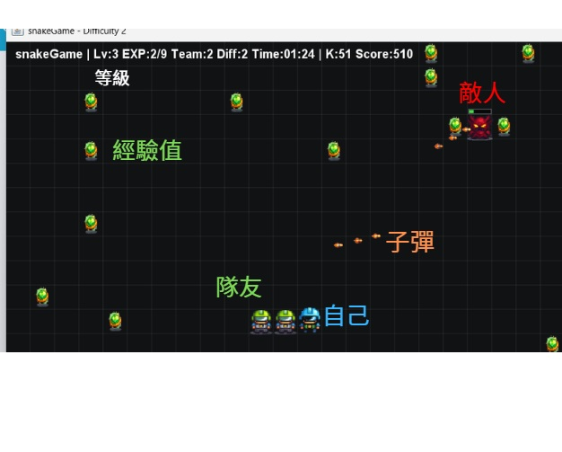

## 貪食蛇進化論：當經典遇上彈幕射擊

本專案是一款結合經典`貪食蛇`玩法與`彈幕遊戲`元素的動作型遊戲系統。
玩家在控制貪食蛇移動與成長的同時，需即時閃避來自敵人或環境所產生的大量彈幕攻擊，
將原本偏向反應與路徑規劃的貪食蛇遊戲，提升為同時考驗操作技巧、策略判斷與即時反應能力的複合型玩法。


## 遊戲畫面

```
透過升級可以增加蛇身長度，躲避敵人
```

## 遊戲核心特色
- 經典貪食蛇機制
- 彈幕攻擊系統
- 即時反應與策略並重
- 難度動態提升


## 專案目標
- 嘗試將兩種經典遊戲類型進行融合設計
- 練習遊戲系統中多實體同時互動的架構設計
- 探討操作負荷與遊戲難度之間的平衡關係
